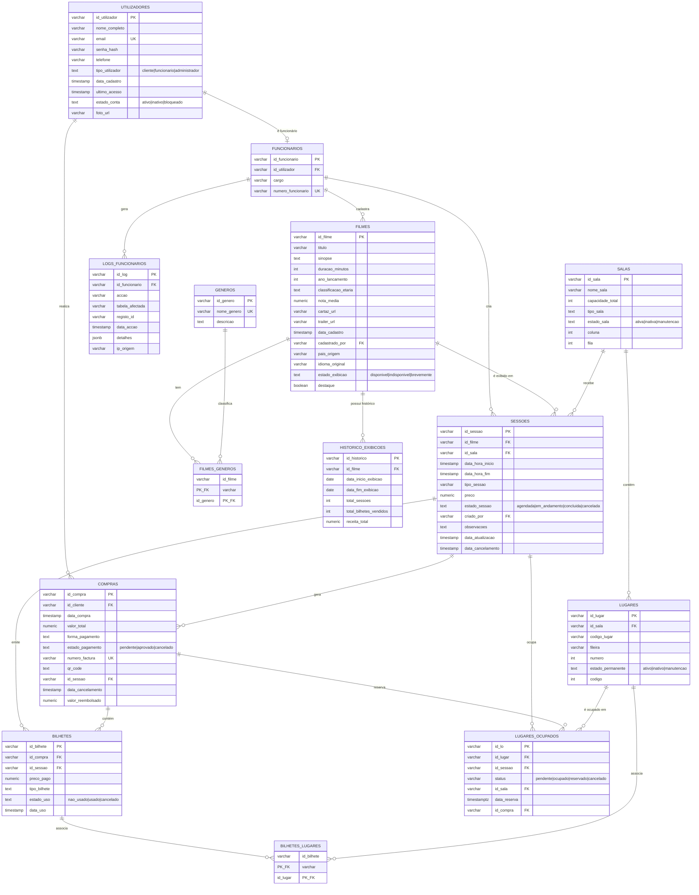

# DER — Diagrama de Entidade-Relacionamento
## Projecto: TicketFlash (ONJANGO-DEV-02)

> Este diagrama corresponde ao schema real em `database/schema.sql`.
> Pode ser visualizado em qualquer editor com suporte a Mermaid (GitHub,
> GitLab, VS Code com a extensão "Markdown Preview Mermaid Support",
> [mermaid.live](https://mermaid.live), Obsidian, Notion, etc.).

## Notas de modelação

- **`FILMES_GENEROS`** e **`BILHETES_LUGARES`** são tabelas de associação
  N:N (chave primária composta).
- **`LUGARES_OCUPADOS`** representa a ocupação de um lugar **numa sessão
  específica** — o mesmo lugar físico (`LUGARES`) pode estar "ocupado" na
  sessão das 18h e "livre" na sessão das 21h do mesmo dia.
- **`HISTORICO_EXIBICOES`** e **`LOGS_FUNCIONARIOS`** foram identificadas,
  durante a revisão do sistema, como tabelas criadas no schema original
  mas sem nenhuma rota a escrever/ler nelas. `LOGS_FUNCIONARIOS` foi
  corrigida e está em uso (módulo de auditoria); `HISTORICO_EXIBICOES`
  permanece sem uso funcional — candidata a um relatório futuro de
  desempenho de bilheteira por filme.
- Todos os campos de estado (`estado_conta`, `estado_exibicao`,
  `estado_sala`, `estado_permanente`, `estado_sessao`, `estado_pagamento`,
  `estado_uso`, `status`) têm `CHECK constraints` no schema, adicionadas
  durante a revisão (o schema original não validava estes valores ao
  nível da base de dados).
